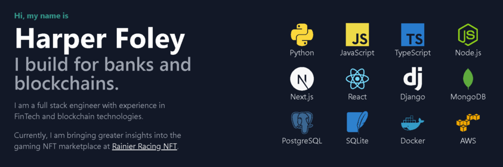

  

## Harper Foley

Greetings! I'm Harper Foley, a full-stack software developer with a passion for distilling complex technical concepts into layman's terms. My background in tech investment banking and Navy Special Operations has equipped me with the skills to effectively communicate with both technical and non-technical stakeholders. I take pride in enabling my team's success and gaining the support of senior leadership through clear and concise explanations.

## Thriving in High-Risk and Ambiguous Environments

I thrive in fast-paced, high-risk, and ambiguous environments. Throughout my military career, I led teams of bomb technicians in challenging and dynamic situations, where adaptability and quick thinking were crucial. These experiences have sharpened my ability to perform under pressure and find effective solutions in the face of uncertainty.

## Leadership and Mentorship

As a leader, I find immense joy in guiding and mentoring my teammates. Advocating for their career progressions and supporting their growth is a top priority for me. I believe in fostering a collaborative and supportive environment that empowers individuals to reach their full potential.

## The Joy of Software Development

Being an engineer and builder at heart, software development is a perfect fit for my innate curiosity and problem-solving nature. I love the process of inventing and simplifying, but my greatest joy comes from tackling complex problems alongside highly intelligent and driven individuals. Collaborating with a team of like-minded individuals on intricate challenges is where I find the most satisfaction.

## Let's Connect

If you're interested in collaborating on projects, discussing leadership and mentorship, or exploring the world of software development, I would love to connect with you. Feel free to reach out to me via email at harper.e.foley@gmail.com or connect with me on LinkedIn at [linkedin.com/in/harper-e-foley/](https://www.linkedin.com/in/harper-e-foley/). You can also explore my GitHub profile at [github.com/hfoley2013](https://github.com/hfoley2013) to discover more about my work and projects.

I'm excited to engage with driven individuals and continue my journey of growth and innovation in the captivating field of software development!
